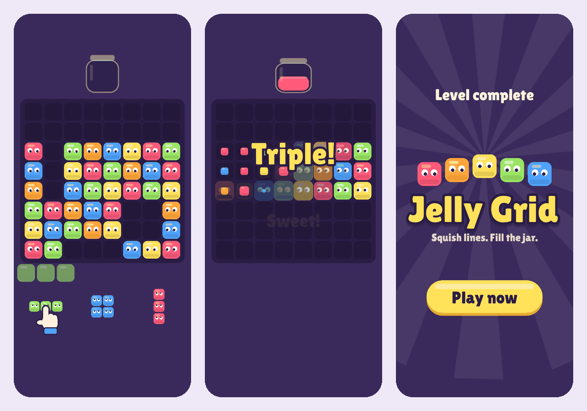

# Jelly Grid

A playable ad for a block puzzle where every block is a jelly creature that watches your finger.
PixiJS v8, GSAP and TypeScript, packaged as one self-contained file per ad network.

**[Play on your phone](https://rashevskyyy.github.io/jelly-grid/play/)** ·
**[Showcase with build sizes and downloads](https://rashevskyyy.github.io/jelly-grid/)**

## What it does

A scripted 20–30 second session, the way real playables are built: the hand demonstrates the first move,
three moves escalate from one cleared line to two to three, and the jar fills on the last one. A wasted move
ends in a near miss instead. Either way the player lands on a full-screen end card.

The feel is the point. Blocks sit on damped springs, so they squash on landing, stretch when picked up and send a
ripple through their neighbours. Cleared blocks fly into the jar along random arcs. Combos add hit-stop, trauma-based
screen shake and a label. Every block's eyes follow the finger, and on desktop the cursor.

## Numbers

| | |
|---|---|
| Build size | 553 KB HTML (AppLovin, Unity, ironSource, Meta), 178 KB ZIP (Google) |
| Upload limits | 5 MB AppLovin / Unity / Google, 4 MB ironSource, 2 MB Meta |
| Image and audio files | none: graphics are drawn in code, sound is synthesized |
| Display font | subset to the glyphs on screen, 10.7 KB → 2.5 KB |
| Time to interactive | 0.2 s; 0.7 s with CPU throttled 4×; 1.0 s at 6× |
| JS heap | 6.4 MB after load, 5.1 MB after a full session and GC |
| Garbage per second | cut by 40% idle and 35% while dragging after profiling |
| Tests | 33 unit tests; static preflight of every network build |
| Frame rate on a real phone | _open `/play/?debug` on the device and fill this in_ |

Timings and memory were measured in headless Chromium with software WebGL, so real devices with a GPU render faster.

## How it's built

- **`src/game/model/`** is the puzzle in plain TypeScript with no Pixi imports. `Game.place()` returns a
  `MoveResult` describing everything that happened, and the view only animates that data.
- **`src/game/levels/level1.ts`** is the scripted session. Its tests guarantee the 1–2–3 line escalation, that
  the jar fills only on the last intended move, and that a wasted move ends in a near miss.
- **`src/network/`**: the game talks to one `AdNetwork` interface. Adapters wrap MRAID, Google's `ExitApi`
  and Meta's `FbPlayableAd`, and the right one is picked at build time, so each build contains only its own API.
- **`src/core/app.ts` + `build/pixiLean.ts`**: the WebGL renderer is created without `Application`, and Pixi's
  optional modules are stubbed out, so WebGPU, Canvas, filters and accessibility never reach the bundle.
- **`src/core/clock.ts`** drives GSAP from the Pixi ticker. One loop for rendering, tweens and springs:
  hiding the ad freezes everything, and hit-stop is a single call.
- **`src/game/view/spring.ts`** integrates springs with fixed substeps, so motion is identical at 20 and
  120 fps. **`motion.ts`** holds the particle arc and the screen shake as pure, tested functions.
- **`src/game/view/jellyTuning.ts`** keeps every feel number in one file.
- **`src/audio/`** synthesizes all sound with Web Audio. No context exists before the first gesture, it is
  suspended while the ad is hidden, and it re-unlocks after iOS interruptions.
- **Allocation-free hot paths**: the per-frame loop and pointer moves reuse scratch points and pooled sprites;
  particles come from a pool; combo labels are rasterised at startup so a combo never hitches.
- **`scripts/check-builds.ts`** runs after every full build and fails on extra files, external resources,
  a missing or foreign network API, or a missing orientation tag.

## Commands

| Command | What it does |
|---|---|
| `npm run dev` | Dev server for the web build, reachable from a phone on the same Wi-Fi |
| `npm run dev:mraid` | Dev server with a mock MRAID container |
| `npm test` | Unit tests |
| `npm run build` | Font subset, every network build, size limits and preflight checks |
| `npm run build -- applovin meta` | Only the listed networks (no preflight) |
| `npm run showcase` / `npm run showcase:preview` | Assemble and serve the showcase site |
| `npm run typecheck` | TypeScript check |

Requires Node.js 22.18+. Add `?debug` to the web build for an on-device fps, frame time, boot time and heap readout.

## Build targets

| Target | Output | Limit | Store exit |
|---|---|---|---|
| `web` | `dist/web/index.html` | none | opens this repository |
| `applovin` | `dist/applovin/index.html` | 5 MB | `mraid.open()` |
| `unity` | `dist/unity/index.html` | 5 MB | `mraid.open()` |
| `ironsource` | `dist/ironsource/index.html` | 4 MB | `mraid.open()` |
| `google` | `dist/google.zip` | 5 MB | `ExitApi.exit()` |
| `meta` | `dist/meta/index.html` | 2 MB | `FbPlayableAd.onCTAClick()` |

## Testing in the networks' own tools

- **AppLovin**: upload `dist/applovin/index.html` to [Playable Preview](https://p.applov.in/playablePreview?create=1&qr=1),
  play to the end, tap the CTA and confirm the successful-click message. Scan the QR code with the AppLovin
  Playable Preview app to test on a phone.
- **Google Ads**: upload `dist/google.zip` to the [HTML5 validator](https://h5validator.appspot.com/adwords/asset)
  with **Select for App Campaigns** checked.
- **Meta**: load `dist/meta/index.html` in Meta's Playable Preview Tool and confirm the CTA fires.
- **Unity Ads / ironSource** have no public upload tool; their MRAID path is shared with AppLovin and
  covered by `npm run dev:mraid`.

## Deploy

Every push to `main` runs typecheck, tests, all builds with limits and preflight, then publishes to GitHub Pages:
`/` is the showcase, `/play/` the playable, `/builds/` the upload-ready files. Page copy lives in `showcase/profile.ts`.

## Credits

- Font: [Lilita One](https://fonts.google.com/specimen/Lilita+One) by Juan Montoreano, SIL Open Font License 1.1
  (`src/assets/fonts/OFL-LilitaOne.txt`).
- Graphics: drawn in code at startup. Sound: synthesized at runtime.
- Built with Claude (Anthropic) as an AI pair programmer.
